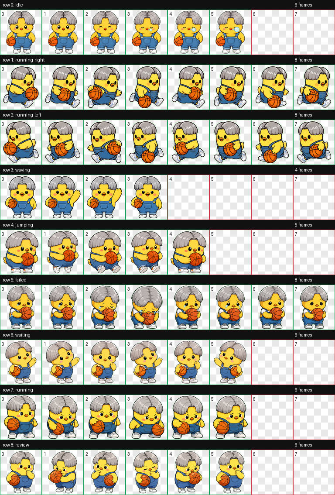

# CodeX Pets

Custom pets for Codex Desktop.

## Available Pets

### Hoop Chick

A yellow basketball chick with gray middle-part bowl-cut hair, blue overalls, white sneakers, an orange basketball, and a sleepy idle nose bubble.



Required install files:

- `hoop-chick/pet.json`
- `hoop-chick/spritesheet.webp`

## Install

Clone or download this repository, then run one of the install scripts from the repository root.

Windows PowerShell:

```powershell
powershell -ExecutionPolicy Bypass -File .\install.ps1 hoop-chick
```

macOS, Linux, or WSL:

```bash
./install.sh hoop-chick
```

Manual install:

1. Copy the `hoop-chick` folder into your Codex pets directory.
2. The default pets directory is `$HOME/.codex/pets`.
3. If you set `CODEX_HOME`, use `$CODEX_HOME/pets` instead.
4. Open Codex Desktop.
5. Go to Settings > Personalization > Pets.
6. Click Refresh and select the Hoop Chick pet shown from `hoop-chick/pet.json`.

Codex should read the pet as `custom:hoop-chick`.

## Repository Contents

- `hoop-chick/pet.json` - Codex pet manifest.
- `hoop-chick/spritesheet.webp` - 1536 x 1872 animated pet spritesheet.
- `hoop-chick/preview/` - visual previews for browsing this repository.
- `install.ps1` and `install.sh` - optional helper scripts.

## Privacy

This repository intentionally contains only shareable pet files and preview assets. It excludes private machine data, local paths, account credentials, and personal configuration.
